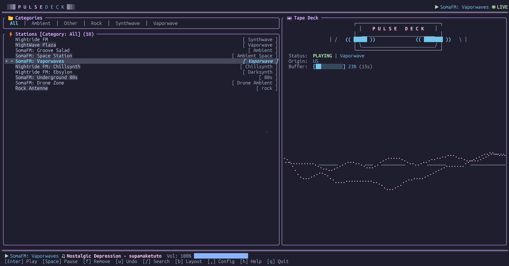

<div align="center">

# ✦ PulseDeck ✦

**A focused terminal internet radio player with fast search, saved stations, themes, visualizers, and resilient playback.**

*Search, preview, save, and stream public radio stations without leaving the command line.*

[](https://crates.io/crates/pulsedeck)
[](https://opensource.org/licenses/MIT)
[](https://www.rust-lang.org/)
[](#-installation)
[](https://github.com/milgaj84/pulsedeck/actions/workflows/ci.yml)

</div>

---



---

## What is PulseDeck?

PulseDeck is a **focused terminal internet radio player** with a retrowave soul, built in Rust. It helps you discover, preview, save, and stream public radio stations from your terminal with fast search, polished playback controls, themes, visualizers, and resilient audio handling.

It ships pre-loaded with handpicked synthwave, chiptune, and cyberpunk stations so it sounds great from the first keypress. But you can search, save, and play **any public internet radio station in the world**.

Think of it as: *a neon radio console for the terminal: quick to launch, easy to tune, and built for listening.*

> PulseDeck was formerly named DriftFM. The project was renamed to avoid confusion with existing and historical radio-related uses of the old name. Existing DriftFM config is copied into the new PulseDeck config directory on first launch.

---

## What makes it different?

Most TUI radio players just wrap ffplay. PulseDeck is purpose-built from scratch in Rust with features you'd otherwise only find in native desktop apps:

- 📡 **Search 30,000+ stations** from the global radio-browser.info catalog by name, tag, country, language, or codec, with mirror failover and local result ranking for cleaner discovery
- 🔊 **Smooth tuning transitions**: switching stations fades out the current stream and fades in the new one, like turning an analog dial
- 🎧 **Preview before saving**: in search, `Space` auditions a station without saving, while `Enter` saves it to your Library and plays it
- 🎨 **6 built-in themes**: Retrowave, all 4 Catppuccin flavors (Mocha, Macchiato, Frappé, Latte), and a Terminal theme that follows your emulator's ANSI palette
- 🎛️ **Three-way dashboard layout**: press `b` to cycle Split View, Library Focus, and Signal Focus
- 📊 **Deck visualizers**: press `v` to cycle RTA Spectrum, Real Oscilloscope, and Simulated Oscilloscope
- 💾 **Library management**: saved stations persist between sessions, rows show compact country/bitrate/health metadata, and removals are undoable with `u`
- 🪪 **Station details**: press `i` in normal mode to inspect grouped identity, playback, catalog, and health metadata for the highlighted station
- 🧭 **Command palette**: press `:` or `Ctrl+p` to search and run common actions, including metadata refresh, settings, help, export, retry, and Playback Doctor
- 🧾 **Persistent History**: opt-in settings to save song titles to `history.json` and persist across runs; view with `g`
- 💤 **Sleep Timer**: press `t` to open a sleep-timer panel; nudge by 5 minutes with ↑ / ↓, jump to presets (15-120 min) with number keys, turn it off with `0` / `c`, and playback fades out and stops when time is up
- 📥 **Import / Export**: export your library to `.m3u` in-app with `e`, or import/export via the command line with preview and enrich-only modes
- 🩺 **Playback Doctor**: press `d` to inspect output, metadata, reconnect, decoder, recent events, and recovery hints while troubleshooting a stream
- 🔔 **Desktop notifications**: a quiet system notification can show the current track when a new song starts
- 🎛️ **Resilient streaming**: PulseDeck uses a direct live-HTTP playback path, ICY-aware stream reading, MP3-specific decoding, live-stream-safe seek refusal, and a non-blocking visualizer tap; auto-reconnect retries up to 3× on dropout, and manual retry with `r` also works
- 🖥️ **Compact-screen protection**: terminal windows below 80x24 show a clean diagnostic instead of letting deck art and borders collapse into visual static
- 🔁 **Audio output recovery**: default-device playback retries once after hardware-style sink failures, helping PulseDeck recover from transient headset or Bluetooth dropouts

---

## Installation

**Prerequisites:** [Rust & Cargo](https://rustup.rs/) (1.75+)

> On Linux, also install ALSA dev headers first:
> ```bash
> sudo apt-get install libasound2-dev   # Debian/Ubuntu
> sudo dnf install alsa-lib-devel       # Fedora
> ```

### From crates.io (recommended)

```bash
cargo install pulsedeck
```

### From source

```bash
git clone https://github.com/milgaj84/pulsedeck.git
cd pulsedeck
cargo run --release
```

That's it. No config files to write. No API keys. Stations are pre-loaded and the player starts immediately.

---

## How to use it

PulseDeck is keyboard-driven. Press **`h`** at any time to see the full control reference.

### Core shortcuts

| Key | Where | What it does |
| :--- | :--- | :--- |
| `↑` / `↓` or `j` / `k` | Library or search | Move through the visible list |
| `Enter` | Library | Play the highlighted saved station |
| `Enter` | Search | Save the highlighted result to your **Library**, then play it |
| `Space` | Search | Audition the highlighted result without saving it |
| `Ctrl+Enter` | Search | Audition too, when your terminal reports the key combo |
| `/` / `Ctrl+f` / `F3` | Anywhere in normal mode | Open worldwide station search |
| `:` / `Ctrl+p` | Normal mode | Open the command palette |
| `Esc` | Search or overlay | Leave search / close overlay |
| `f` | Library only | Remove the highlighted station from your **Library** |
| `u` | Library only | Undo the most recent station removal |
| `Tab` / `Shift+Tab` | Library | Switch genre categories |
| `i` | Library | Show details for the highlighted station |
| `d` | Library / playback | Open Playback Doctor diagnostics |
| `g` | Library | Show Recent Tracks, or persistent Listening History when history saving is enabled |
| `e` | Library | Export saved library to M3U format |
| `Space` | Playback | Pause / resume |
| `s` | Playback | Stop playback |
| `r` | Playback error | Retry the current stream |
| `t` | Playback | Open the sleep timer panel (±5 min, presets, off) |
| `+` / `-` | Playback | Volume up / down with fine low-volume and faster high-volume steps |
| `m` | Playback | Mute / unmute |
| `Ctrl+-` / `Alt+-` | Search | Volume down without leaving search |
| `Ctrl+=` / `Ctrl++` / `Alt+=` / `Alt++` | Search | Volume up without leaving search |
| `Ctrl+m` / `Alt+m` | Search | Mute / unmute without leaving search |
| `b` | View | Cycle Split View / Library Focus / Signal Focus |
| `v` | View | Cycle RTA Spectrum / Real Osc / Sim Osc |
| `,` | App | Open settings |
| `h` / `?` | App | Show / hide help |
| `q` | App | Quit, or close an open overlay first |

`Enter` is the search commit action: it adds the highlighted search result to your saved Library and starts playback. `Space` auditions the highlighted result without saving it, so you can sample stations before committing them to `library.json`.

While in search, plain printable characters continue to edit the query. Use the Ctrl/Alt audio shortcuts for volume and mute if the current stream needs adjustment without abandoning the active search.

---

## Workflow

**Finding and adding a new station:**

1. Press `/`, `Ctrl+f`, or `F3` to open search, then type a station name or focused query such as `tag:ambient`, `country:BA`, `lang:english`, or `codec:mp3`. Search starts after **2+ characters** and waits briefly while you type, so quick typing does not send a request for every letter.
2. Use `↑` / `↓` to highlight a result.
3. Press `Space` to audition the highlighted station without saving it. You stay in search mode and can keep browsing.
4. Press `Enter` to save that result to your **Library** and start playing it immediately. It will be available next time you launch PulseDeck.
5. Press `Esc` instead to leave search without adding anything.

Search results show saved stations with a star and include compact genre/country/bitrate/codec/check metadata when available. The highlighted result also explains why it matched, such as exact tag, country code, codec, last-check status, saved status, HTTPS, votes, or click signals. Long station names are truncated around the active search term when possible, so matching text stays visible even in narrow result rows. Search titles and the footer both reinforce the `Space` preview versus `Enter` save-and-play split.

**Search prefixes:** plain text still searches station names, but you can focus Radio Browser searches with prefixes:

| Prefix | Also accepts | Example | Searches |
| :--- | :--- | :--- | :--- |
| `name:` | `station:` | `name:lofi` | Station names |
| `tag:` | `genre:` | `tag:ambient` | Genres and tags |
| `country:` | `cc:` | `country:BA` | Country name or two-letter code |
| `lang:` | `language:` | `lang:english` | Station language |
| `codec:` | `format:` | `codec:mp3` | Stream codec |

**Managing your library:**

- Your Library is the saved station list shown on launch.
- If the Library is empty, PulseDeck shows a starter card with the most useful first actions.
- Rows show the selected station, currently playing station, country, bitrate, and local health hints without overflowing long names.
- To inspect the highlighted station, press `i` for grouped Station Details: identity, playback, catalog, and health fields, including tags, country code, language, codec, bitrate, local health, last-check status, homepage, UUID, votes, recent click count, and stream URL when available.
- Use the command palette (`:` / `Ctrl+p`) and run **Refresh library metadata** to enrich older saved stations with missing Radio Browser metadata without replacing your saved-facing station name, stream URL, or genre.
- To remove a saved station, highlight it in the Library and press `f`.
- After removal, press `u` to restore removed stations in reverse order. PulseDeck keeps a bounded history of the 10 most recent removals.
- Switch between genre categories with `Tab` / `Shift+Tab`; PulseDeck remembers your last cursor position per category, falling back to the playing station when there is no saved position.

**Using the signal deck:**

- Press `b` to cycle between Split View, Library Focus, and Signal Focus.
- Press `v` to cycle the signal display between RTA Spectrum, Real Oscilloscope, and Simulated Oscilloscope.
- In RTA Spectrum mode, the signal screen shows a subtle tuning pulse during connection handshakes, so slow streams look active instead of blank.
- During stop or station changes, the deck stays visually active while the audio fade-out completes.
- Critical stream errors are mirrored inside help and settings overlays, so connection failures remain visible even when a modal is open.
- Watch the footer chips for playback state, volume, layout, and visualizer mode.

**Playback stability model:**

PulseDeck treats internet radio as a live stream, not a seekable file. The active playback path reads the HTTP response directly through an ICY-aware stream reader, wraps it in a small decoder buffer, and uses Rodio's MP3 decoder directly instead of the generic format-probing decoder. Real seeks return `Unsupported` instead of discarding live audio bytes.

The current playback path is optimized for MP3 internet-radio streams. Other codecs can still appear in search and station metadata, but playback support for non-MP3 streams needs explicit decoder selection before it should be advertised as equally supported.

The visualizer is a passive tap on the decoded audio source. It copies small batches only when the UI sample buffer is available, so visual rendering does not block the audio path and PulseDeck does not maintain a separate decoded-PCM playback queue.

PulseDeck can request ICY song-title metadata when enabled in settings. Metadata is on by default, remains optional, and can be disabled without changing saved stations or playback controls, which is useful if a rare stream behaves better with clean audio bytes only.

If the internal audio engine stops accepting commands, PulseDeck surfaces a visible playback error instead of silently ignoring play, pause, stop, or retry actions.

**Recovering from playback errors:**

- Press `r` to retry the current stream when an error leaves PulseDeck with a stream URL to retry.
- Press `s` to stop playback if the stream or output device is no longer useful.
- Press `d` to open Playback Doctor and inspect output, metadata, reconnect, decoder, recent event diagnostics, and recovery hints.
- Press `,` and check **Audio Output** if a headset, Bluetooth sink, PulseAudio, or PipeWire route changed.
- Press `/` to search for another station if the current stream itself is offline.

**Coming back tomorrow:**

- PulseDeck remembers your library between sessions.
- PulseDeck also remembers your volume, mute state, layout mode, visualizer mode, and selected theme in config files.
- Settings such as auto-resume, audio output, notifications, history persistence, and theme are saved automatically.
- If *Save song history* is enabled, the `g` panel becomes persistent Listening History backed by `history.json`; when it is disabled, `g` remains a session-only Recent Tracks list.
- Enable *Auto-resume last station* in settings (`,`) and it starts playing where you left off automatically.

---

## Command Line Interface (CLI)

PulseDeck features a headless CLI mode to backup or migrate your library of stations:

- **Export Library**:
  ```bash
  pulsedeck export ~/my_library.m3u
  pulsedeck export ~/my_library.json
  ```
  This writes your current library to the specified path in M3U or JSON format (auto-detected by file extension).

- **Import / Merge Library**:
  ```bash
  pulsedeck import ~/my_library.m3u
  pulsedeck import ~/my_library.json
  pulsedeck import ~/my_library.m3u --preview
  pulsedeck import ~/my_library.json --enrich-only
  ```
  This parses the input file and merges all unique stations into your library, deduplicated by Radio Browser UUID when available and normalized stream URL otherwise. `--preview` shows new, duplicate, enrichment, and skipped counts without saving. `--enrich-only` refreshes matching saved stations without adding new stations.

- **Help / Version**:
  ```bash
  pulsedeck --help
  pulsedeck --version
  ```

---

## Settings

Press `,` to open the settings panel. Current options:

- **Desktop notifications**: show current track changes while you listen. On WSL, PulseDeck falls back to a Windows notification balloon if the normal Linux notification path is unavailable.
- **Auto-resume last station on startup**: start the previous station automatically on launch.
- **Save song history**: when enabled, the `g` panel shows persistent Listening History saved to `history.json`; when disabled, `g` shows session-only Recent Tracks.
- **Audio Output**: choose `Default` or a detected output device such as `pulse`, `pipewire`, speakers, or Bluetooth headphones exposed by the audio backend. In `Default` mode, PulseDeck retries once after hardware-style sink failures so transient output changes can recover without a restart. If only `pulse` or `pipewire` appears, select that in PulseDeck and route it to your headphones in PipeWire/PulseAudio with `wpctl`, `pavucontrol`, or your desktop sound settings.
- **Theme**: cycle between Retrowave, Catppuccin Mocha, Catppuccin Macchiato, Catppuccin Frappé, Catppuccin Latte, and Terminal. The Terminal theme uses reset backgrounds and ANSI colors so PulseDeck follows your terminal emulator palette.
- **Stream Song Info Metadata**: request ICY now-playing metadata when stations support it. Turn this off if a rare stream behaves better with clean audio bytes only.

Use `↑` / `↓` or `j` / `k` to move between settings. Use `Space`, `Right`, `l`, or `d` to step values forward; use `Left`, `h`, or `a` to step values backward. Native ALSA/JACK probe diagnostics are suppressed during audio device discovery so backend chatter does not overwrite the TUI. Settings are saved automatically to a JSON file in your config directory.

---

## Migration from DriftFM

PulseDeck automatically copies existing DriftFM config files into the new config directory on first launch:

| Old path | New path |
| :--- | :--- |
| `~/.config/driftfm/library.json` | `~/.config/pulsedeck/library.json` |
| `~/.config/driftfm/ui-state.json` | `~/.config/pulsedeck/ui-state.json` |

The old `~/.config/driftfm` directory is left untouched as a backup. Future saves go to `~/.config/pulsedeck`.

---

## Platform Support

| Platform | Status |
| :--- | :--- |
| Windows | ✅ Full support (native WASAPI audio) |
| Linux | ✅ Full support (ALSA/PulseAudio/PipeWire via CPAL/Rodio, with selectable outputs) |
| macOS | ✅ Full support (CoreAudio) |
| WSL | ✅ Supported with Windows notification fallback |

---

## Code Quality

PulseDeck's CI checks:

- Rust formatting with `cargo fmt --check`
- Clippy across all targets and features with warnings treated as errors
- Tests across all targets and features
- Release build verification
- RustSec dependency audit with `cargo audit`

The codebase keeps UI colors routed through the semantic palette in `theme.rs`, isolates blocking audio work from the TUI event loop, keeps runtime search/metadata workers in `src/runtime.rs::AppDriver`, separates production startup loading from pure app state construction with `AppParts`, and uses regression tests to guard playback, startup, search, settings, library, and compact-layout behavior.

---

## Built with

*All native Rust: no ffmpeg, no Python, no Electron. A single self-contained binary.*

- [Ratatui](https://ratatui.rs/) - Terminal UI framework
- [Rodio](https://github.com/RustAudio/rodio) + [CPAL](https://github.com/RustAudio/cpal) + [Symphonia](https://github.com/pdeljanov/Symphonia) - Audio output selection and native playback, with the active stream path using Rodio's MP3 decoder directly (no ffmpeg dependency)
- [Tokio](https://tokio.rs/) - Async runtime for API search
- [reqwest](https://docs.rs/reqwest) - HTTP streaming with ICY metadata support

---

## License

MIT - see [LICENSE](LICENSE) for details.
